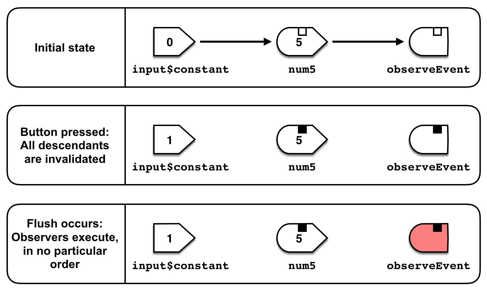
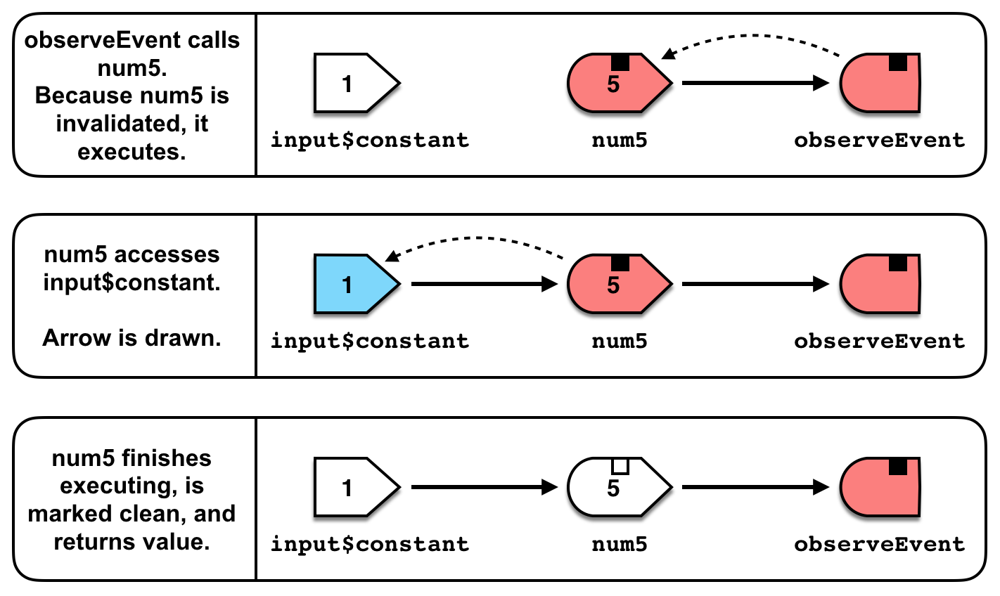
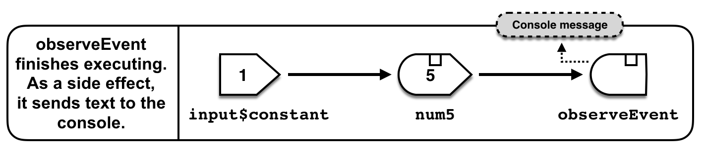
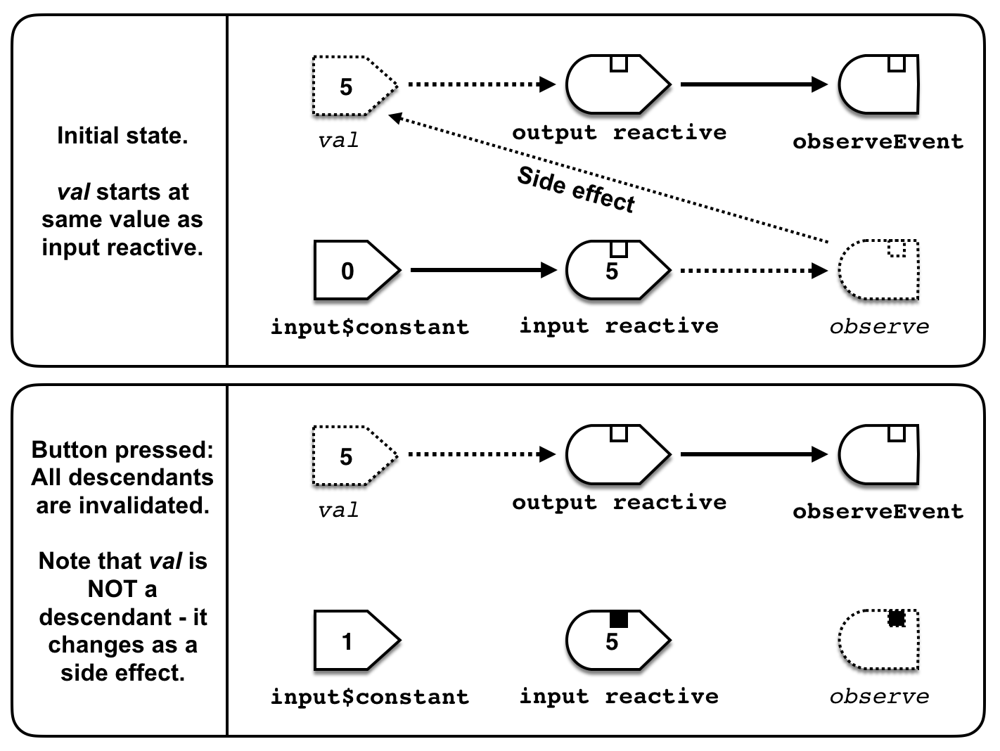
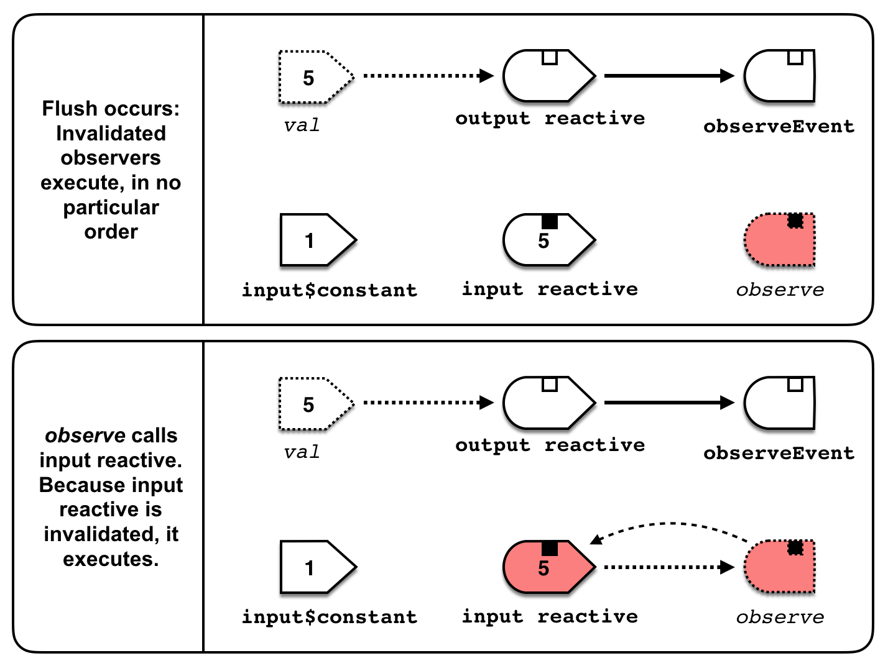
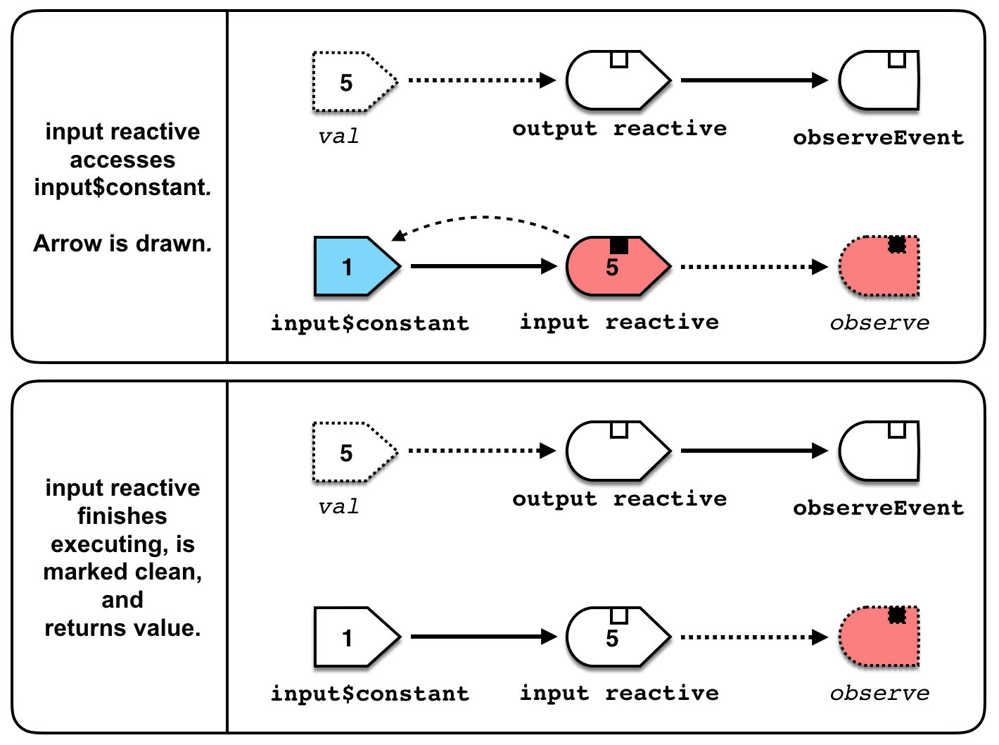
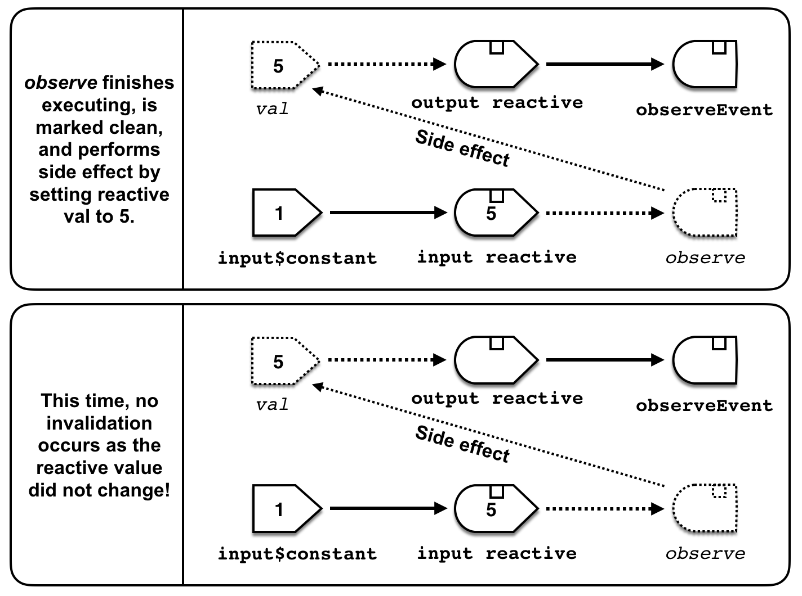

# Create a reactive value that only triggers when its value changes

*This example is modified from the `reactive-dedupe` example from [daattali/advanced-shiny](https://github.com/daattali/advanced-shiny/tree/master/reactive-dedupe).  I have added a shiny script to help my brain.*

## Dean's original text

If you understand shiny and reactivity well, you will know that a reactive expression gets re-run whenever any of its reactive dependencies are invalidated. This is generally the desired behaviour, but there is one caveat that comes up occassionally: even if the underlying value of the reactive dependency hasn't changed, it can still be considered "invalidated". This can mean that a reactive expression will run again with exactly the same values because its dependencies have not changed, even though they're invalidated. Joe Cheng (author of shiny) has [a solution](https://github.com/rstudio/shiny/issues/1484#issuecomment-262812760) for this.

Define a `dedupe` function as follows:

```
dedupe <- function(r) {
  makeReactiveBinding("val")
  observe(val <<- r(), priority = 10)
  reactive(val)
}
```

And now you can wrap any `reactive(...)` expression with `dedupe(reactive(...))` so that it will only get invalidated if the actual value changes.

## Why (and how) does this work?

First, note that **THIS IS A HIGHER ORDER REACTIVE**.  I couldn't find anywhere else on the internet that explained what higher-order reactives were.  These were mentioned in Joe Cheng's _Shiny Ladder of Enlightenment_ (see [Effective Reactive Programming](https://www.rstudio.com/resources/videos/effective-reactive-programming/)), included below for completeness:

_Ladder of Enlightenment_:  How high are you on the ladder? (

**BOTTOM OF LADDER (Beginner)**

 1. Have you used input and output?
 2. Have you used reactive()?
 3. Have you used observe() and/or observeEvent()?<br>
    Have you written dependent reactive() expressions?<br>
    Have you used isolate()?
 4. Do you know when to use reactive() vs. observe()?<br>
    Have you used invalidateLater()?
 5. **Have you written a higher-order reactive?**
 
**TOP OF LADDER (Advanced)**

Higher-order reactives (at least based on my sample size of 1) transform the original reactive expression into a new reactive expression that depends on a reactive value.  For other examples, see the Shiny [throttle and debounce](https://shiny.rstudio.com/reference/shiny/latest/debounce.html) functions.  Here's the [code commit](https://github.com/rstudio/shiny/pull/1510/commits/c0a298e48410460f95a97f8035cfbdd95fd08621) for these functions.

This reprex implements a [closure](https://en.wikipedia.org/wiki/Closure_(computer_programming)), which is a higher-order function (i.e. function that returns a function).  It is a closure because it is accessing the reactive variable that was created in the scope of the dedupe function, and it is returning a reactive expression (which is essentially a function!) that depends on that reactive variable.

### Simple Reactive Execution Scheduling





### Higher-order Reactive Execution Scheduling




